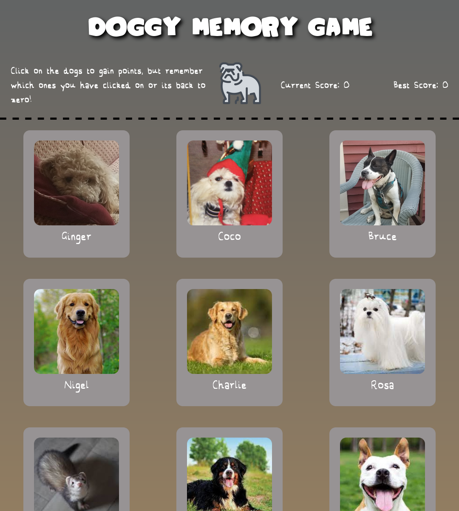

# Doggy Memory Game

View the project live [here](https://brenton-j-andrews.github.io/memory_game/).

---

##### About this project

Completed for [The Odin Project](https://www.theodinproject.com/lessons/node-path-javascript-memory-card) JavaScript course.

This application is a simple game where you click on the pictures of dogs (and one ferret!) and try not to reclick the same image twice. Upon clicking any image, the images are all reshuffled. Reach a score of 12 and you win!

---
##### Frameworks

This project was built using React.

---

##### Takeaways

This project served as a practical introduction to using React functional components and state hooks rather than class components. 
